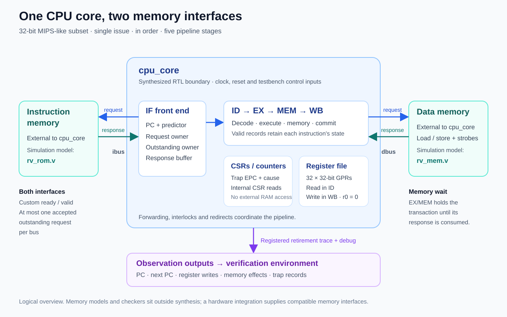
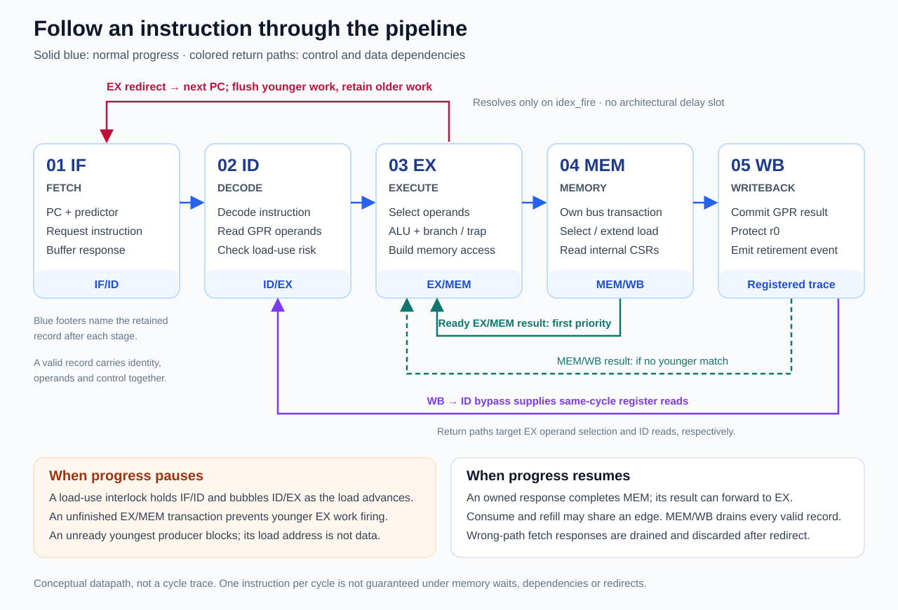
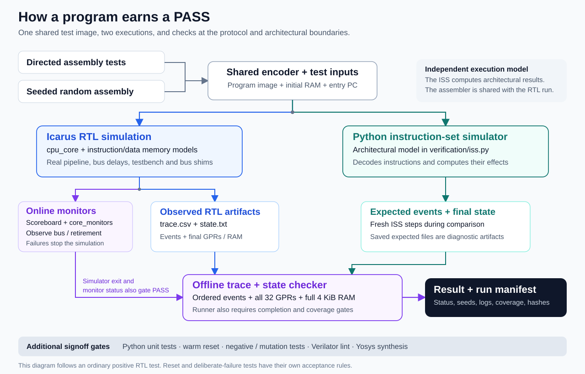

# Architecture guide

This project is a 32-bit, single-issue, in-order CPU with five pipeline stages and a documented MIPS-like instruction subset. Its central design rule is that each instruction keeps ownership of its state until the next stage or memory interface accepts it. That rule connects forwarding, memory stalls, branch recovery, and exactly-once retirement.

The three diagrams show the system boundary, instruction flow through the pipeline, and verification flow. They describe the implemented RTL at the block level. The [design case studies](showcase.md) connect these structures to measured forwarding, byte-lane, and reset behavior.

## 1. System boundary: the CPU and its surroundings

The synthesizable top is [`cpu_core`](../rtl/core/cpu_core.v). It contains the pipeline, branch predictor, 32-register file, ALU, dependency logic, internal control/status registers (CSRs), and retirement trace/debug logic. Register `r0` always reads as zero. Instructions and data use separate external buses.

| Interface or block | What it does | Where it belongs |
|---|---|---|
| Instruction bus (`ibus`) | Sends a PC address and receives an instruction word. | CPU interface to external instruction memory. |
| Data bus (`dbus`) | Sends a load/store address, store data and byte strobes; receives a completion/data response. | CPU interface to external data memory. |
| ROM and RAM models | Supply program/data contents and configurable response delays. An optional bus shim adds request stalls and response holds. | Simulation environment; excluded from the synthesized CPU. |
| CSRs | Hold cycle/retirement/stall/redirect counters and trap EPC/cause. Valid CSR word loads complete internally. | Inside the CPU; these accesses do not use the external data bus. |
| Retirement trace | Describes each completed instruction or trap, including PC, register and memory effects. | Generated by the CPU and consumed by verification. |

Both buses use a custom **ready/valid** protocol. A transfer occurs on a clock edge when `valid` and `ready` are both asserted; a blocked sender holds its payload stable. Each bus permits at most one accepted request whose response has not yet been consumed. Consuming an old response and accepting a new request on the same edge is allowed. These interfaces are not AXI.

The default data address range is 4 KiB, with byte-addressed little-endian accesses. That range check does not instantiate a 4 KiB RAM inside `cpu_core`. The current synthesis includes trace/debug logic and excludes both external memories; see [synthesis scope](synthesis.md). The [ISA subset](isa_subset.md) defines supported instructions, alignment, the memory map, and trap behavior.

## 2. Pipeline: instruction flow, dependencies, and recovery

The main path runs from left to right. Forwarding paths carry a newer operand value back to a consumer. Hold and redirect paths control whether an instruction can advance or must be discarded.

| Stage | Main job | State retained at its output |
|---|---|---|
| **IF — instruction fetch** | Select the next PC using sequential flow or prediction; own the instruction request and response. | IF/ID holds instruction, actual PC, prediction metadata, and instruction identity. A separate fetch response buffer can wait for IF/ID space. |
| **ID — instruction decode** | Decode controls, read registers, identify real source dependencies, and apply WB-to-ID bypass. | ID/EX holds operands, immediate, controls, and instruction identity. |
| **EX — execute** | Select forwarded operands, run the ALU, calculate addresses/store lanes, and resolve control flow or traps. | EX/MEM holds the result or the complete memory/trap operation. |
| **MEM — memory completion** | Retain ownership until an external response arrives, or complete an ALU/CSR/trap record internally. | MEM/WB holds the completed result and retirement information. |
| **WB — writeback** | Write an eligible nonzero destination register and emit a registered retirement/trap event. | The committed architectural state and trace event. |

Every pipeline boundary has a `valid` bit. Empty stages carry no instruction; held stages retain their instruction and payload. A stage may consume its old instruction and accept a replacement on the same edge. MEM/WB drains without backpressure. **EX/MEM is blocking:** while its external memory operation is incomplete, a younger instruction cannot execute into that occupied slot; earlier buffers can fill and then wait.

Dependency handling has two separate paths. **WB-to-ID bypass** supplies a register being written on the same edge as decode reads it. **EX forwarding** chooses the youngest matching producer: EX/MEM has priority over MEM/WB. If that youngest value is unavailable, the consumer waits instead of using an older match. In particular, a load's effective address is never forwarded as its loaded data. An immediate load-use dependency holds decode and inserts an empty ID/EX slot as the load advances.

### Load-use dependency

For `lw r2, 0(r1)` followed by `add r3, r2, r2`:

1. ID reads the load's base register; EX calculates its address and checks alignment/range.
2. EX/MEM retains the address, destination, size and other metadata. It holds one stable request until acceptance, then waits for that request's response without reissuing it.
3. The dependent add waits for the load's value. When the response is consumed, retained address/size metadata selects and extends the returned data. The ready result can then forward to the add.
4. MEM/WB commits the load result and later the add result in program order. The trace lets the checker verify both events individually.

There is no fixed cycle count for this example: legal bus waits change how long the instructions remain in each stage.

### Redirect recovery

The predictor proposes a next PC during fetch; its prediction travels with the instruction. EX determines the actual next PC only when the instruction can advance (`idex_fire`). A prediction mismatch or trap redirects fetch. The resolving instruction and older work survive; younger buffered/decode work is cleared. Already-presented or accepted wrong-path fetch requests retain their protocol ownership, then stale responses are drained and discarded before target fetching proceeds.

There is **no architectural delay slot**: a wrong-path instruction after a taken control transfer must not commit. Branch comparisons use forwarded operands. Conditional branches train the predictor when they execute; trap/ERET handling uses the internal CSR state. Detailed priorities and simultaneous-event rules are in [microarchitecture.md](microarchitecture.md).

## 3. Verification: from a program to checked evidence

The CPU is the hardware under test. The memory models, bus shims, online monitors and scoreboard run alongside it in simulation. The Python instruction-set simulator (**ISS**) and offline checker run outside that hardware environment.

For an ordinary positive program test, the [runner](../scripts/run_tests.py) starts from assembly and initial memory, assembles the program, and supplies the same starting state to two execution paths:

- **RTL simulation** produces retirement CSV, final register/RAM state, coverage, and optionally a waveform. Online monitors check safety and protocol rules. The scoreboard correlates accepted external data requests, responses, and later retirement events.
- **Independent ISS execution** computes architectural instruction results using its own PC, registers, memory and instruction semantics. It is instruction-accurate, not a model of the five-stage timing; the RTL trace does not choose its path or operands.

The [offline checker](../verification/checker.py) compares each architectural event against the ISS and checks the complete final register/RAM state. Acceptance also requires the expected completion/event count, drained CPU and scoreboard, zero online errors, and the required nonzero coverage bins. Checking only the final answer would miss errors in intermediate loads, control flow, or repeated side effects.

Full signoff adds unit/protocol tests, warm-reset scenarios, constrained-random programs, deliberate fault mutations, and independent lint/synthesis checks. Reset tests use their own explicit protocol/recovery contract. Lint and synthesis examine the RTL separately; they do not replace architectural simulation. Fresh run directories and source/artifact hashes connect a report to its tested inputs. Current results and evidence limits are recorded once in the [validation report](validation_report.md).

### RTL and verification source map

| Diagram block | Implementation |
|---|---|
| Pipeline registers, fetch ownership, bus control and trace | [`cpu_core.v`](../rtl/core/cpu_core.v) |
| Fetch prediction | [`bpu.v`](../rtl/core/bpu.v) |
| Decode and register file | [`control_unit.v`](../rtl/core/control_unit.v), [`reg_file.v`](../rtl/core/reg_file.v) |
| EX arithmetic and source selection | [`alu.v`](../rtl/core/alu.v), [`forwarding_unit.v`](../rtl/core/forwarding_unit.v), [`hazard_unit.v`](../rtl/core/hazard_unit.v) |
| Internal counters and trap state | [`csr_perf.v`](../rtl/core/csr_perf.v) |
| Simulation top and memory timing | [`tb_core.sv`](../sim/tb/tb_core.sv), [`rv_rom.v`](../sim/mem/rv_rom.v), [`rv_mem.v`](../sim/mem/rv_mem.v), [`rv_bus_shim.sv`](../sim/mem/rv_bus_shim.sv) |
| Online safety and bus-to-retirement correlation | [`assertions.sv`](../sim/assertions/assertions.sv), [`scoreboard.v`](../sim/score/scoreboard.v) |
| Program generation and architectural checking | [`encoding.py`](../verification/encoding.py), [`iss.py`](../verification/iss.py), [`checker.py`](../verification/checker.py) |
| Test selection and execution | [`testplan.json`](../tests/testplan.json), [`run_tests.py`](../scripts/run_tests.py) |

### Terms used in the diagrams

| Term | Meaning here |
|---|---|
| IF / ID / EX / MEM / WB | Instruction fetch / instruction decode / execute / memory completion / writeback. |
| `valid` | This interface or stage currently owns a meaningful payload. |
| `fire` | A transfer/consumption happens on this clock edge. For a bus it is `valid && ready`; for a pipeline stage it also depends on that stage's completion and dependency rules. |
| GPR / CSR | General-purpose register / control and status register. |
| BPU / BHT / BTB | Branch prediction unit / branch history table / branch target buffer. |
| UID | A dynamic instruction identity carried through the pipeline and trace. Discarded fetches can leave gaps. |
| Retire | Finish an instruction architecturally in program order. Traps have trace events but do not increment the successful-instruction count. |
| ISS | Instruction-set simulator: an independent software model of architectural execution. |
