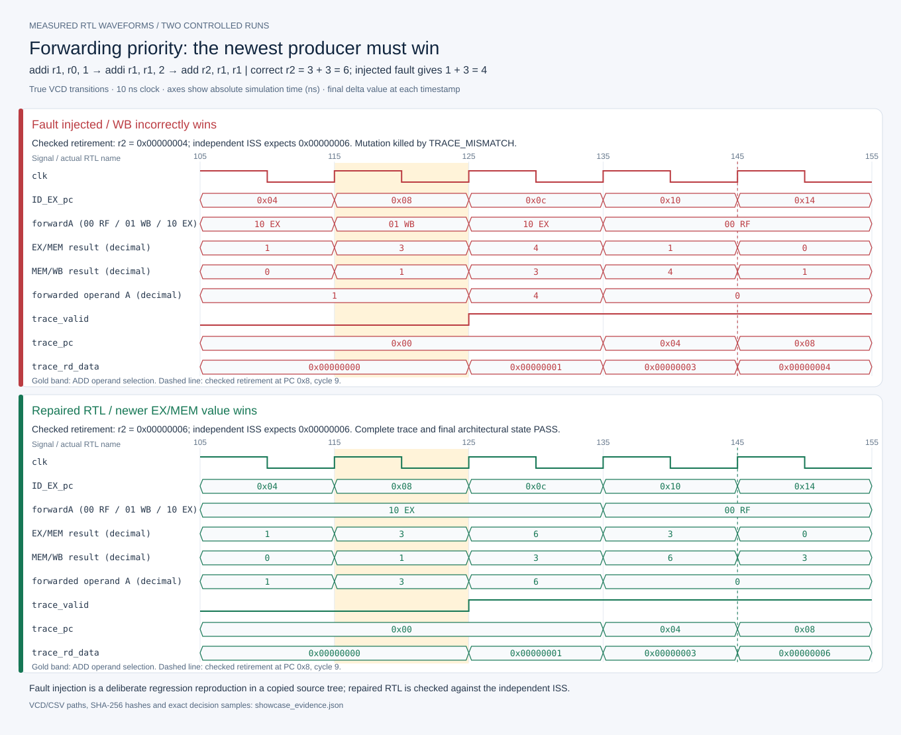
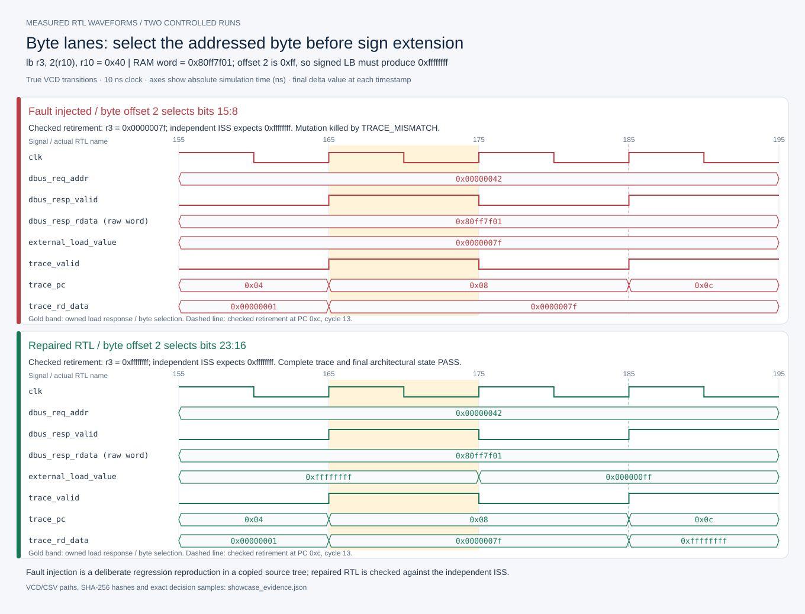

# Five-stage CPU: design and verification case studies

A 32-bit, single-issue, in-order CPU implementing a documented MIPS-like subset, with separate instruction/data buses and an independent architectural checker. The central engineering problem is preserving instruction identity and exactly-once effects when forwarding, memory waits, redirects, and reset overlap.

The [validation report](validation_report.md) records regression, lint, synthesis, and source-integrity results. The case studies below connect the design decisions to measured behavior and executable checks.

## Pipeline at a glance


The [illustrated architecture guide](architecture.md) adds the complete system boundary, the verification flow, a load/redirect walkthrough, and a map from diagram blocks to source files.

Each pipeline boundary retains a valid bit and its instruction's payload. EX/MEM holds the complete memory operation until its owned response is consumed; MEM/WB drains without backpressure. A redirect preserves the resolving instruction and older work, clears younger pipeline state, and drains outstanding stale fetch responses. Both external interfaces use a custom ready/valid contract with at most one accepted transaction outstanding per bus. They are not AXI.

The [microarchitecture](microarchitecture.md) defines stage ownership and transfer rules, and the [ISA subset](isa_subset.md) defines architectural behavior. The [core RTL](../rtl/core/cpu_core.v) implements both contracts. Memory waits and control-flow recovery can reduce throughput below one instruction per clock.

## Reproducing the demonstration

The demonstration requires Python 3.10+ and Icarus `iverilog`/`vvp`. The verification code uses the Python standard library. From the repository root:

```powershell
python scripts/build_showcase.py
python scripts/run_tests.py --suite directed --test core_warm_reset
```

The [showcase builder](../scripts/build_showcase.py) recompiles and runs the selected directed programs and isolated mutations, then generates measured VCD illustrations. Its [evidence metadata](assets/showcase_evidence.json) links the generated run, source artifacts, waveform hashes, and extracted samples. The second command runs all nine reset phases and the expected missing-phase rejection. Each invocation reports its own artifact location under `build/runs`.

| Area | Evidence | Design property |
|---|---|---|
| Pipeline ownership | Pipeline diagram and EX/MEM state | A delayed memory response retains its destination metadata and cannot replay a request. |
| Forwarding | Operand and retirement waveforms | The youngest matching producer wins; an unavailable result blocks its consumer. |
| Byte lanes | Load waveform and directed assembly | Address offset, lane selection, sign extension, aligned store data, and strobes agree. |
| Warm reset | Nine protocol scenarios and recovery coverage | Pending ownership is canceled; stores already visible in RAM survive without replay. |
| Acceptance | Manifest, architectural checker, and validation report | Positive execution matches the ISS, and deliberate defects produce functional mismatches. |

The full signoff command is:

```powershell
powershell -NoProfile -ExecutionPolicy Bypass -File scripts/run_tests.ps1 -Suite signoff
```

The direct Python equivalent is `python3 scripts/run_tests.py --suite signoff`. Full signoff includes the fixed 32-seed × four-profile random matrix, all directed/protocol cases, negative coverage checks, mutations, and available independent tools.

## Case 1: forwarding priority selects the wrong instruction's value

The original forwarding logic let an older MEM/WB match overwrite a younger EX/MEM match. The repair gives a valid, nonzero EX/MEM destination priority on each used source. If that youngest result is unavailable, the consumer blocks instead of reading an older value. A held consumer also retains transient forwarded operands after their producer leaves WB.

The [directed program](../tests/programs/forwarding_priority.asm) begins:

```asm
addi r1, r0, 1
addi r1, r1, 2
add  r2, r1, r1
```

Correct execution produces `r1=3` and `r2=6`. The isolated `wb_over_ex_forwarding` mutation reverses source-A priority; the checker rejects retirement event 2 with expected `0x00000006`, actual `0x00000004`. This demonstrates sensitivity to an incorrect result, not merely to a simulator crash.



Priority is applied independently to both operands and requires a valid producer with a nonzero destination. An incomplete load cannot forward its address as a result. These rules are implemented in the [forwarding RTL](../rtl/core/forwarding_unit.v) and checked at retirement by the [architectural checker](../verification/checker.py); [CPU-02 and RTL-08](bug_ledger.md) record the corresponding fixes.

## Case 2: byte lanes require consistent address, data, and strobes

With little-endian memory word `0x80ff7f01` at address `0x40`, `lb` from address `0x42` must select byte `0xff` and sign-extend it to `0xffffffff`; `lbu` selects the same byte and zero-extends it. The `wrong_byte_lane` mutation selects bits `[15:8]` instead of `[23:16]` for offset two. The checker rejects event 3 with actual `0x0000007f` instead of `0xffffffff`.



A separate real repair, RTL-10, zero-masks SB/SH source values before lane alignment. Seed 1 had exposed SB data `0xffffffbd` where the canonical bus payload was `0x000000bd` with strobe `0001`. The [memory-lanes program](../tests/programs/memory_lanes.asm) checks signed/unsigned loads, stores, and neighboring-byte preservation. The lane mutation above is an intentional checker challenge, not a claim that it reproduces that exact historical store defect.

The [load/store logic](../rtl/core/cpu_core.v) retains the load offset during stalls and distinguishes architectural store source data from aligned bus data and byte enables. The [memory model](../sim/mem/rv_mem.v) applies the strobes, while the [independent ISS](../verification/iss.py) checks each load result as well as final RAM. [RTL-10](bug_ledger.md) records the store-data fix.

## Case 3: warm reset needed full-core evidence

The gap was verification coverage: a memory-model reset test did not prove that the complete CPU canceled its pipeline and bus ownership correctly. The [full-core reset testbench](../sim/tb/tb_core_reset.sv) interrupts instruction fetch, load, and store at three phases each: request blocked, request accepted while awaiting a response, and response offered before consumption.

Each of the nine scenarios begins after real retirement, clears the core and slave protocol state, checks all registers and RAM, waits beyond the canceled transaction latency for late effects, then checks five restart instructions exactly from PC zero. Nine phase bins and eight recovery bins are mandatory. The paired `+OMIT_SCENARIO=0` run must fail for its specifically missing phase and must not emit the positive completion marker.

The reset contract covers the core and slave together. RAM persists. An accepted store still waiting for response creation is canceled; a store already made visible by the memory model before reset remains visible even if it has not retired, and must not replay. CPU-only reset with stale slave responses is outside this contract. The added scenarios closed a verification coverage gap without requiring a reset RTL change.

Separating request acceptance, response creation, and architectural retirement makes the reset behavior explicit: protocol state clears, while committed memory-model effects remain. [VRF-02](bug_ledger.md), the [reset coverage contract](verification_plan.md), and the [test/requirement mapping](../tests/testplan.json) document these checks.

## What the evidence supports

The project demonstrates RTL ownership discipline, dependency handling, precise architectural checking, executable negative tests, and reproducible artifacts. Every ordinary positive RTL run requires exact trace comparison against an independently executing ISS, complete GPR/RAM comparison, online monitor/scoreboard success, completion/drain, and its required coverage. Source hashes tie reported results to the tested inputs.

The waveform images use fresh simulation samples from deliberately mutated and corrected RTL. They demonstrate checker sensitivity to specific functional defects. Regression totals, lint/synthesis status, and the measured scope are recorded in the [validation report](validation_report.md).
